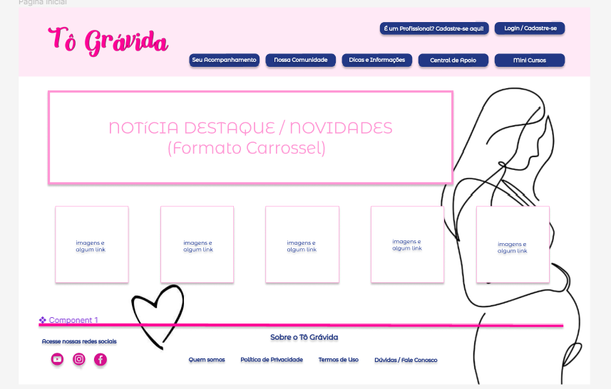

# Projeto_Integrador_PROZ

## Projeto tô Grávida
## Objetivo: Este projeto tem como objetivo ajudar mulheres grávidas a terem uma gestação saudável com base em informações confiáveis sobre alimentação, cuidados, nóticias, eventos,e cursos de curto período, afim de manter a gestante informada sobre vários aspectos da gravidez. Além de fazer a ponte com médicos especialistas que de forma gratuita, podem oferecer um atendimento especializado para as mamães que não podem pagar por uma consulta. E com isso nosso projeto pode ajudar a diminuir a Taxa de Mortalidade Materna Global, que é incorporado pelo item 3(Saúde e Bem-Estar) dos Objetivos de Desenvolvimento da ONU para o Brasil.

### Desenvolvedores do projeto:

 André Viana, Carlos Eduardo Fernandes, Alexandre Ferreira, Anderson, Nara Alencar.